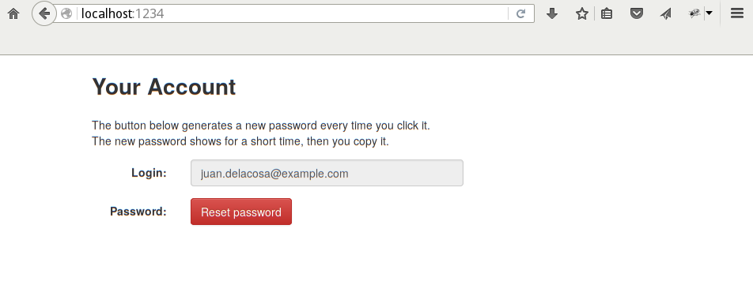
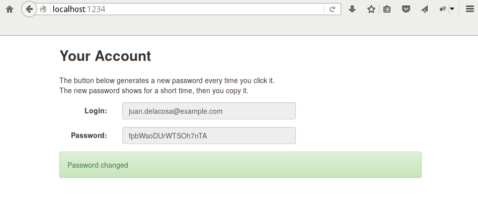
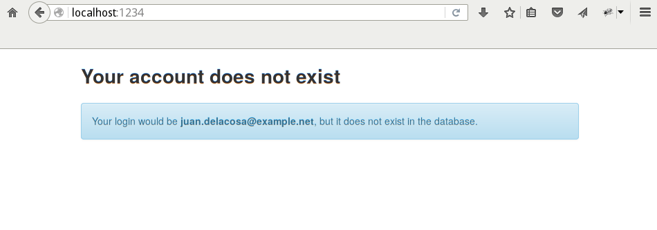

Juan de la Cosa
===============

HTTP server for managing [MariaDB](http://mariadb.org/) users.
Designed to work behind [Sproxy](http://hackage.haskell.org/package/sproxy2).
and assuming users' logins are their email addresses
(MariaDB allows up to 80 characters).

Currently it only let users get new passwords.

Requirements
============
Juan de la Cosa is written in Haskell with [GHC](http://www.haskell.org/ghc/).
All required Haskell libraries are listed in [juandelacosa.cabal](juandelacosa.cabal).
Use [cabal-install](http://www.haskell.org/haskellwiki/Cabal-Install)
to fetch and build all pre-requisites automatically.

Installation
============
    $ git clone https://github.com/ip1981/juandelacosa.git
    $ cd juandelacosa
    $ cabal install

Usage
=====
Type `juandelacosa --help` to see usage summary:

    Usage: juandelacosa [-f|--file FILE] [-g|--group STRING] [-d|--datadir DIR]
                        [(-p|--port INT) | (-s|--socket PATH)]

    Available options:
      -f,--file FILE           Read this MySQL client config file
      -g,--group STRING        Read this options group in the above file
                               (default: "client")
      -d,--datadir DIR         Data directory including static files
                               (default: "...")
      -p,--port INT            listen on this TCP port (localhost only)
      -s,--socket PATH         Listen on this UNIX-socket
                               (default: "/tmp/juandelacosa.sock")
      -h,--help                Show this help text


Database Privileges
===================

```sql
CREATE USER IF NOT EXISTS 'juandelacosa'@'localhost' IDENTIFIED VIA unix_socket;
REVOKE ALL, GRANT OPTION FROM 'juandelacosa'@'localhost';
GRANT UPDATE ON `mysql`.* TO 'juandelacosa'@'localhost';
GRANT SELECT ON `mysql`.`user` TO 'juandelacosa'@'localhost';
```

Screenshots
===========




